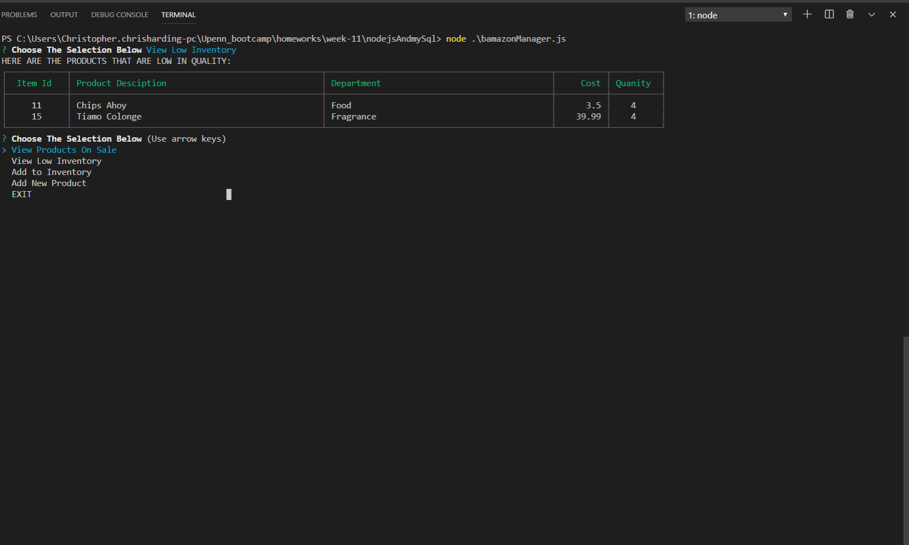

# nodejsAndmySql

# DEMO

Click This Link: [https://drive.google.com/file/d/19GvPK-KDP7pWHRIuMMYnG5Fuw5a6wsdz/view]

**************************************************************************

# INTRODUCTION

This app is more like Amazon;however, it's more involved in the back-end. This app will allow the user to pick the product they wanted and the back-end will take the user's orders from the inventory, which is stored in mySQL. Also, it allows the user to play a manager role, which is to check inventory and also adds in a new product.

***************************************************************************
# CUSTOMER VIEW

1. Create a table including the following columns:
    
    * item_id
    * product_name
    * department_name
    * price
    * stock_quanity

2. Connect it to the mySQL.

3. Create an application called `bamazonCustomer.js`.This will display the table with all of the items

4. Create a prompt that will display these two messages:
    * Which product would you like to buy?
    * How many units of the product would you like to buy?

5. After the customer made that order, the back-end will check they have enough. If they don't have enough, then the message will display that the quanity is insufficient and the order will not go through.

6. If the order is made, the stock quanity is updating and also it shows the total cost of the product.

***************************************************************************

# MANAGER VIEW

* This portion displays these options:

    * `View Products For Sale` - Shows the table with every available item.

    * `View Low Inventory` - Tells the manager to check one of the items to see if the inventory is low.

    * `Add To Inventory` - Tells the manager to add more quanities using inquirer.prompt.

    * `Add New Product` - Allows the manager to add a new product to the store.

